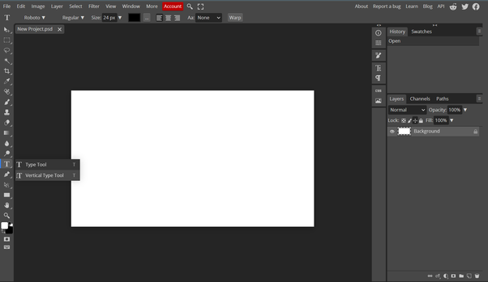
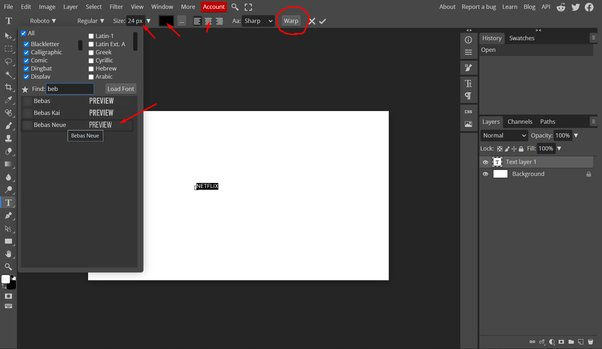
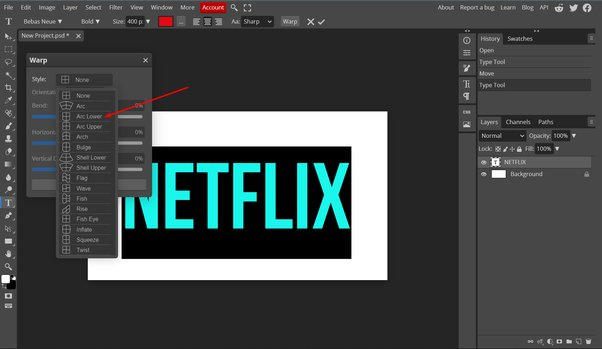
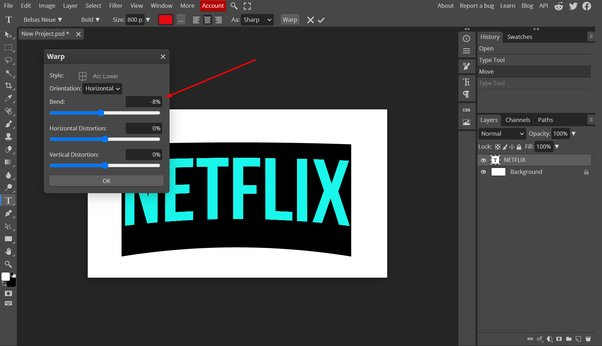
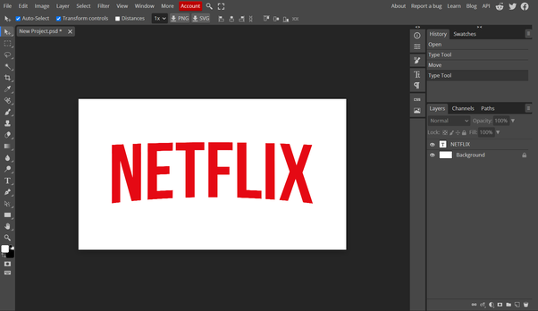

# FINAL with LMH


vueCLI + vueBOOTSTRAP + AXIOS + TMDB 활용한 프로젝트

```
https://loy124.tistory.com/296
```


**Animation on Scroll (AoS)**

https://michalsnik.github.io/aos/

https://egghead.io/blog/how-to-use-the-animate-on-scroll-aos-library-in-vue

https://jungkimhoon.tistory.com/17


**vue Carousel 3D**

https://vuejsprojects.com/vue-carousel-3d


**Font import in Vue**

https://www.folkstalk.com/tech/add-a-google-font-to-a-vuejs-with-code-examples/


**alt +  shift + F  **

indentation 자동 맞춤


Vue 

```
//netflix

https://vuejsexamples.com/netflix-clone-built-using-vue-js/
https://vuejsexamples.com/a-netflix-clone-website-built-with-vue-and-tailwind-css/


//TMDB
https://github.com/hazarbelge/vuejs-the-moviedb-spa?ref=vuejsexamples.com
```

















**TMDB > JSON **

```
jaypakkorea
L
```


https://creamilk88.tistory.com/194


iframe 높이 화면 맞춤 (출처:https://code-study.tistory.com/35)

```html
<template>
  <div class="VideoDetail">
    <h1>VideoDetail</h1>
    <div class="imagePosition" v-if="video">
      <div class="videoPosition">
        <iframe  class="youtubeFrame" :src="videoUrl" frameborder="0" allowfullscreen></iframe>
      </div>
      
    </div>
  </div>
</template>

<script>
export default {
    name : 'VideoDetail',
    props: {
      video : Object
    },
    computed: {
      videoUrl() {
        const videoId = this.video.id.videoId
        return `https://www.youtube.com/embed/${videoId}`
    },
  }
}
</script>


<style>
.VideoDetail{
  margin-right:5rem;
}

.imagePosition{
  position : absolute;
}

.videoPosition{
  /* display : block;
  position : relative;
  width : 50%;
  height : auto; */
  position : absolute;
  width: 50%;
  height: 0;
  padding-bottom: 56.25%;
}
.videoPosition iframe{
  position : absolute;
  width: 100%;
  height: 60%;
}

.youtubeFrame{
  position : absolute;
  top: 0;
  left : 5px;
  width:98%;
  height : auto;
}

#video {
  position: absolute;
  width: 100%;
  height: 100%;
}

.backMonitor{
  display: block;
  width:50%;
  height: auto;
}
</style>
```

