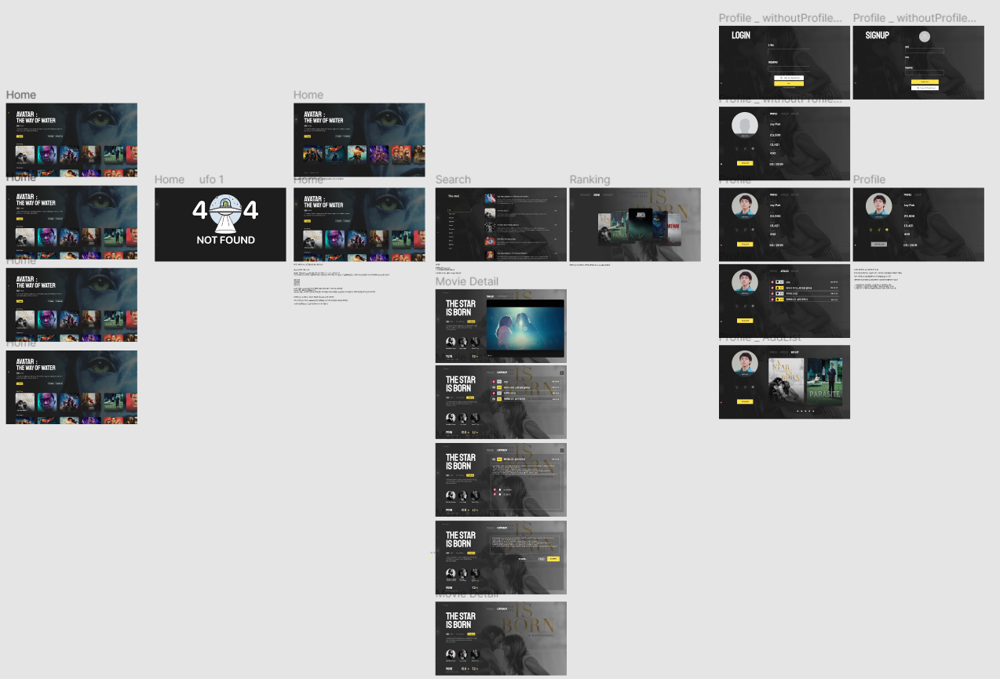
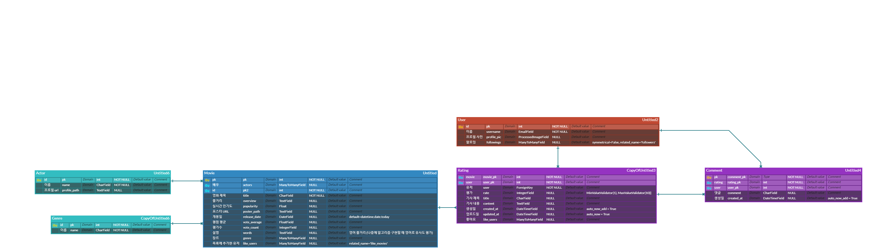
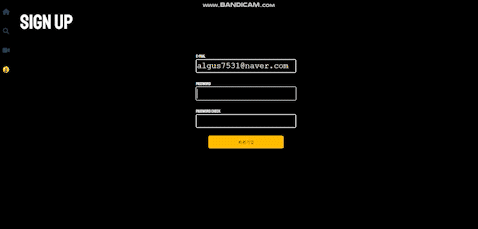
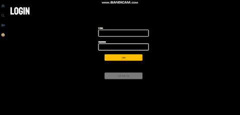
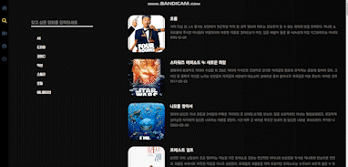
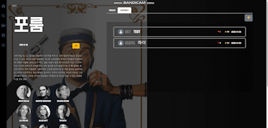

 # Gucken

### 왜 Gucken 구큰 인가?

국카스텐(Guckkasten) : ‘Guck'(보다) + 'Kasten'(상자) , 만화경. 영화의 초시.


만화경처럼 함께 영화를 보고 대화를 나누는 영화 추천 기반 커뮤니티 웹 서비스를 제공하겠다는 의미에서 이름을 따옴. 또한 버튼을 누르면 다음 사진으로 넘어가는 만화경처럼 클릭하면 유저가 원하는 화면을 보여주는, 사용자 친화적 UI UX 를 디자인을 했음. 


# 가. 개발 기획


## 1) 개발 기간

📅 2022 11.16 ~ 2022.11.24 (9일)


## 2-1) 전략

OTT 시장의 어려움!


코로나 팬데믹으로인한 사회적 거리두기 해제 이후 사람들의 OTT 서비스에대한 관심사와 구독자와 관심수가 급감했다. 이에대한 해결책으로 Netflix CEO는 서비스에 게임을 제공하겠다고 했지만 발표 이후 주가 급락. (시장에서는 별로 설득력이 없다고 판단)


## 2-2) 우리의 전략은

 sns, 즉 영화기반 토론장을 만들고, 그 안에서 사람들간에 경쟁심을 부추긴다.특정 요건을 충족하는 충성 고객에게 벳지를 줘 보상한다.Follower가 많을수록, 영화에 평론을 많이 남길수록, 좋아요를 많이 받을수록 보상

         

## 3) 구현 알고리즘

Top 10 영화에 가중치 반영(모든 유저) **Jellyfish** 검색(모든 유저) 코사인 유사도 기반 추천(가입 및 좋아요 남긴 유저)

###  ㄱ - Top 10 영화 가중치

​		****

v = 영화 평가 수

R = 영화 평점 평균

m : 상위 10분위에 든 영화들 수

C = 모든 영화의 평점 평균 (TMDB 1만 기준 약 6)


### ㄴ - 영화 탐색(머신러닝)

**jaro_winkler_similarity**  

**‘아포칼’** 을 검색했을 때 유사도 높은 영화 5개

{'pk': 1579, 'title': '아포칼립토', 'similarity': 0.9066666666666667}, 

{'pk': 539064, 'title': '아포칼립스: 최후의날', 'similarity': 0.825}, 

{'pk': 531876, 'title': '아웃포스트', 'similarity': 0.6888888888888888},

{'pk': 17182, 'title': '아이 포 아이', 'similarity': 0.6507936507936508},

{'pk': 9045, 'title': '아멘', 'similarity': 0.611111111111111}


##  ㄷ - 코사인 유사도 기반


```python
from sklearn.feature_extraction.text import CountVectorizer

from sklearn.metrics.pairwise import cosine_similarity
```

1. 불용어 제거

   countVec = CountVectorizer(max_features=10000, stop_words='english')

2. 영화 키워드 벡터라이징

    dataVectors = countVec.fit_transform(xMovie).toarray()

3. 코사인 유사도

    similarity = cosine_similarity(dataVectors)

   


#### **데이터** : TMDB 사이트에서 1만 여개의 영화 정보

**참고** : Kaggle TMDB 5000 ‘인구 통계학적 필터링’, ‘ 컨텐츠 기반 필터링’ 모델


## 4) 와이어 프레임

 디자인 툴 **Figma**를 이용하여 제작 



- 페이지별 UI 구성 기획

- 페이지 옆 메모 기능을 활용해 팀원간의 비동기적 소통 및 기록


## 5) ERD

Django DB 구성에 필요한 roadmap 설계


## 6) API 설계


| HTTP verb | URL패턴            | 설명                                                |
| --------- | ------------------ | --------------------------------------------------- |
|           | `admin`            | admin.site.urls                                     |
|           | `movies/`          | include('movies.urls')                              |
|           | `profile/`         | include('accounts.urls')                            |
|           | `accounts/`        | include('dj_rest_auth.urls')                        |
|           | `accounts/user/`   | include('dj_rest_auth.urls')                        |
|           | `accounts/signup/` | include('dj_rest_auth.registration.urls')(회원가입) |


| HTTP verb | URL 패턴                          | 설명                      |
| --------- | --------------------------------- | ------------------------- |
| GET       | `profile/<int:user_pk>/`          | profile 페이지로 이동     |
| POST      | `profile/<int:user_pk>/follow/`   | profile 유저 팔로잉       |
| GET       | `profile/<int:movie_pk>/article/` | profile 유저가 쓴 글 조회 |
| PUT       | `profile/<int:user_pk>/update/`   | profile 사진 업데이트     |


| HTTP verb | URL 패턴                                                     | 설명                               |
| --------- | ------------------------------------------------------------ | ---------------------------------- |
| GET       | `movies/`                                                    | 영화 전체 목록 죄회                |
| GET       | `movies/top/`                                                | top10  영화 목록 조회              |
| GET       | `movies/popularity/`                                         | 인기급상승 영화 10개 조회          |
| GET       | `movies/<int:user_pk>/recommendation/`                       | 머신러닝 10개 추천 조회            |
| GET       | `movies/<int:movie_pk>/`                                     | 단일 영화 조회                     |
| POST      | `movies/<int:movie_pk>/addlist/`                             | 유저의 좋아요 버튼                 |
| GET       | `movies/search/genre/all/`                                   | search 모든 영화 조회              |
| GET       | `movies/search/genre/<int:genre_pk>/`                        | search 해당 장르 영화 조회         |
| GET       | `movies/search/<str:movie_name>/`                            | 유저가 검색한 영화                 |
| POST      | `movies/<int:movie_pk>/articles/`                            | 영화에 평론 조회 및 작성           |
| DELETE    | `movies/<int:movie_pk>/articles/<int:rating_pk>/`            | 해당영화 평론 삭제                 |
| POST      | `movies/<int:movie_pk>/articles/<int:article_pk>/comments/`  | 해당 영화 평론에대한 댓글 작성     |
| POST      | `movies/<int:movie_pk>/articles/<int:article_pk>/comments/like/` | 해당 영화 평론에대한 유저의 좋아요 |


# 나. 프로젝트 소개

## 개발 도구


- BE: Django

- DB: Sqlite3

- FE: Vue, Vuex, VueBootStrap

- UI tool: Figma

  

## 주요 기능

**ㄱ.  회원가입 페이지**



- 비밀번호 확인이 틀리거나, 이미 가입되어 있는 이메일이면 alert로 알려줌

- 회원가입 완료시 자동 로그인 -> 홈 화면으로 이동

- 가입 시 프로필 사진 생략 가능( 이 경우 기본 이미지로 최초 설정 )

  


**ㄴ.  로그인 페이지**



- 로그인시 바로 메인 페이지로 이동

- 회원가입 페이지 이동 버튼 배치

  

**ㄷ.  로그아웃 및 비로그인 유저 기능 제한**


- 로그아웃 버튼 클릭시 확인을 위한 창 뜸

- 비로그인 유저는 마이페이지, 차트 페이지 클릭시 로그인 페이지로 이동
- 게시물 읽기, 검색은 되나 영화 like, 게시글 등록, 게시글 좋아요, 게시글 댓글 기능 제한 


**ㄹ.  메인 페이지**


- `Best Rating` : 10000개의 데이터를 가중치를 통해 10개 선정
- `Popularity` : 인기 급상승 영화 10개 선정


**ㅁ. 영화 검색 페이지**



- 장르별 영화 50개씩 추천(기본값은 모든 장르 랜덤)

- 코사인 유사도 기반 검색 영화와 비슷한 제목을 가진 10개 추천

  

**ㅂ.  영화 상세 페이지**


- like 버튼을 통해 나만의 위시리스트에 등록할수 있고, 줄거리, 개봉일, 배우진, 평점 및 공식 예고편이 뜸
- 배우 사진을 클릭하면 배우별 프로필이 뜸


**ㅅ. 영화 상세 페이지 커뮤니티, 삭제, 좋아요**



- 영화별 게시글을 적을 수 있음
- 게시글별 댓글을 적을 수 있고, 좋아요를 할 수 있음.
- 게시글 삭제는 본인이 쓴 글만 가능함


**ㅇ. 유저기반 영화 추천 페이지**


- like 를 한 영화들을 기반으로 비슷한 내용, 줄거리를 가진 영화들을 

  코사인 유사도를 통해 10개를 추천해줌.


**ㅈ. 유저 프로필 페이지**


- 나의 팔로워, 팔로잉 리스트 를 볼 수 있음.
- 내가 쓴 게시글 들의 내용, 좋아요 수, 평점을 볼 수 있음.
-  내가 like 한 영화들을 볼 수 있음.
- 남의 프로필에 들어가면 follow, unfollow 버튼이 뜸.(실시간으로 배찌 밑, 팔로워, 팔로잉 수에 반영됨)


# 다. 일지 & 느낀점

**작성자 : 박정호 + 이미현**

**11.16**

db 정리 , 프론트 라우터 정리

Kaggle TMDB 5000 가중치 알고리즘을 반영한 10개 TOP Rated 영화 추출.

이 데이터를 DRF (backend) 와 Vue.js (frontend) 서로 통신 성공


느낀점 : db가 1만개의 영화 데이터라 Index 페이지를 돌 때마다 가중치가 도는건 비효율적이라고 생각.

아마도 여기에서 이진탐색, DFS , BFS 와 같이 효율적인 탐색을 해야할 것으로 생각된다.

일단은 for 반복문으로 1만개의 데이터를 순회하며 가중치를 계산하고, 이를 frontend로 넘겨주는 수준이다.

프론트는 라우터를 정리하여 페이지별 기능을 받을 준비를 하고, 대략적인 프레임틀을 미리 만들어 놓았다  


**11.17**

회원가입, 로그인, user profile backend 와 연결, add list 버튼 구현


느낀점 : token 이라는 개념으로 유저의 로그인 여부를 결정하고, POST, PUT 방식에서 그 토큰을 header에 담아 유저의 진위 여부를 판단하는 로직을 짜는 부분이 섬세하게 들어가야했다.

그래도 그 부분의 로직을 깨우친 이후부턴 프로필과 Add List 버튼 구현에는 큰 어려움이 없었다.

프론트를 하며 여러 프레임워크를 쓰면 편하고 이쁘게 된다는것을 배우게되어서 쓴 이후로 디자인 속도가 빨라졌다.


**11.18** 

각각의 영화에 대한 평론 create


느낀점 : 계획단계에서 치밀하지 못했던 부분들이 문제가 생기고 있다.

예를들면 평론을 소수점 단위로 할것인지, 변수 명이라든지.

이런 부분은 좀 더 계획단계에서 세밀해질 필요가 있다고 생각했다.

그럼에도 영화의 id 값을 받아와 그 영화에 한 뎁스가 더 깊은 영화 평론을 만드는 로직을 배워 알찬 하루였다.

백엔드에서 보내온 값을 프론트에서 아이프레임으로도 처리를 하고 모달로도 처리를 하는 등, 기능상은 어려운 것이 없었지만 디자인이 손이 많이가고 점점 복잡해지는 느낌이였다ㅠ

하지만 결과물을 보면 깔끔하고 만족스러웠다!


**11.19**

유저의 좋아요 기반 추천 알고리즘 구현


역시 첫날과 마찬가지로 1만개의 데이터에서 유저가 좋아하는 데이터를 다 조회하며 추천 알고리즘을 도는데 너무 오랜 시간이 들고있다.

내 컴퓨터가 안 좋아서 그런지 10초정도 걸리는데 월요일에 SSAFY 컴퓨터로 시도해보고 데이터를 줄이거나 다른 방향을 생각해봐야겠다.


**11.20**

팔로잉 기능 구현, User Profile 이미지 업로드


유저가 자신의 프로필 사진을 업로드하고 ,그걸 기반으로 댓글 ,팔로워 팔로잉 하는 사람들의 프로필 사진을 볼 수 있게 했다. 이미지 업로드 방식이 new FormData() 라는 특수한 방식이 있다는것을 배웠고,

이 프로피들을 vue bootstrap v-avatar 를 사용하면 더욱 깔끔하고 다이나믹한 느낌을 낼 수 있다는 점을 배울 수 있었다.

프론트에서 팔로잉과 언팔로우 버튼이 다르게 보이는 값을 저장하는 방법을 생각했고, 프로필 이미지를 등록하지 않은 유저는 기본 이미지를에 디자인을 입혀 프로필을 등록하도록 유도하였다.


**11.21** 

기존에 계획했던 네이버 API를 통한 실시간 영화 순위를 크롤링 해오는 것 을 빼고 우리가 가장 자신있고 중요한 부분인 유저의 좋아요 누른 영화의 줄거리 기반 영화 추천 페이지를 강조해 넣기로했다.

다만 1만개의 데이터를 다 순회해서 추천 영상을 프런트에 놔주기 위해선 약 8-9초정도 소요되는데 이것을 오히려 디자인적으로 승화할 수 있다고 생각했다.

영화가 매칭되는동안 화면에서 메시지가 간다면 오히려 정말 우리가 알고리즘이 돌고있다는 기분이 들어 유저들이 신뢰할 수 있을거라 생각했다.

많은 데이터로 로딩시간이 긴것이 오히려 디자인적으로 긍정적이 요소로 작동할 수 있다고 생각했다.

10초정도의 시간동안 사용자가 지루하지 않게 기다리려면 어떻게 해야되는지 고민을 많이 하였고, loding 을 이용하여 스피너와, 글자가 시간마다 바뀌는 방법을 선택했다.

글자를 읽다보면 넣기전 10초에 비해 기다리는 시간이 금방 가는것처럼 느껴졋다


**11.22**

좋아요와 댓글을 구현했다.

이제는 이정도 depth 의 CRUD는 상대적으로 쉽게 느껴진다. 

 각각의 버튼들에대한 디테일한 toogle 조건을 설정해 줘, 애초에 프런트앤드에서 백엔드로 정보가 안 넘어가게, 예를들면 다른사람의 글에는 글 삭제 버튼이 애초에 안 보이게 함으로써 데이터의 무결성을 지키기위해 노력했다.


**11.23**

프로젝트 마무리, 세부 디테일 잡기, 구글 로그인 시도

구글로그인을 시도하였지만, 로그인 창 까지는 떳지만 토큰값을 받아오고 우리 토큰을 대체해서 적용하는 부분에서 잘 되지 않아서 포기를 하였다. 우리의 발표 시간은 10분 이였고 선생님의 말대로 선택과 집중이 필요하여 지금 기능들에도 만족을 하기 때문에 내려놓았다.

다음 프로젝트에는 조금더 시간을 투자해서 다시 도전해서 꼭 성공해보고싶다는 생각을 했다.

어제까지 큰 기능들은 모두 완료하여, 오늘은 폰트가 깨지거나, css가 조금씩 뒤틀린곳 , 백엔드 데이터를 sorting 하는 등 디자인을 사용자 UI UX에 맞게 이쁘게 정리를 하였다.


**11.24**

발표준비

README와 ppt를 준비 

우리가 이때까지 했던 것을 돌아보면서 README와 사람들에게 우리의 기능을 알려줄 ppt, 발표 시연 연습을 했다.

프론트는 흰 백지에서, 백엔드는 테이블도 짜여지지 않은 상태에서 시작을 한지 8일이 지났다.

우리는 흰백지에서 영화 추천, 검색, 커뮤니티 기능, 사용자 페이지 등 여러 페이지를 만들어 냈고,

백엔드는 꽉찬 테이블들과, 여러 API 들을 만들어냈다.

사람들에게 자랑하고싶은 우리의 기능은 너무 많지만 발표 시간이 10분이라는것이 너무 아쉬워서 짧은 시간에 많은 정보를 보여주기 위해 발표 시간을 헛되게 쓰지 않게 노력을 했다!! 

9일동안 고생했다우리~~ 

